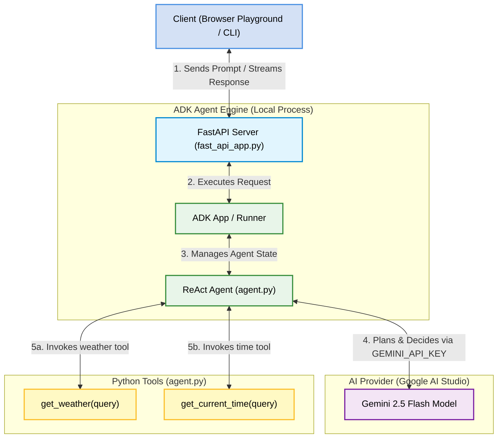

# Antigravity Weather Assistant Agent

This repository contains a lightweight **ReAct (Reasoning and Action) Agent** built using Google's **Agent Development Kit (ADK)** and managed by the **Agents CLI (`agents-cli`)**. 

This repository contains a setup completed by following the hands-on instructions in the official guidebook for **Day 3: Authoring Google Antigravity Skills** of the [5-Day AI Agents: Intensive Vibe Coding Course with Google](https://www.kaggle.com/competitions/5-day-ai-agents-intensive-vibecoding-course-with-google).

### About the Course
Hosted on **Kaggle** and created in collaboration with Google researchers and engineers, this intensive program focuses on **"vibe coding"**—a development paradigm shift where developers use natural language as the primary interface to design, build, and orchestrate complex systems. 
* **Key Topics**: Covers agentic architectures, memory/context persistence, tool integrations, and multi-agent loops.
* **Tech Stack**: Leverages the Gemini API (Google AI Studio), Vertex AI platforms, Agent Development Kit (ADK), and Model Context Protocol (MCP) servers.

---

## Architecture & Component Interaction

The diagram below explains the components of the project and how they interact when a user sends a query (e.g., *"What's the weather like in SF?"*):



### Flow of Execution
1. **User Input**: A user sends a prompt via the browser playground or CLI.
2. **REST Endpoint**: The FastAPI server receives the prompt and passes the execution to the ADK `Runner` session.
3. **Reasoning Loop**: The `ReActAgent` calls the **Gemini 2.5 Flash** model with the user's prompt, instructions, and schemas of the available tools.
4. **Tool Selection**: Gemini determines if it needs more information. If so, it returns a `tool_call` requesting to run a local function (e.g., `get_weather(query="SF")`).
5. **Local Execution**: The agent runs the local python function (`get_weather` or `get_current_time`) and returns the resulting string back to Gemini.
6. **Final Response**: Once Gemini has the required info, it synthesizes a natural language answer and streams it back to the client interface.

---

## Project Structure

```text
weather-assistant/
├── app/
│   ├── agent.py               # Core agent definitions, tools, and LLM configuration
│   ├── fast_api_app.py        # FastAPI server wrapping the ADK reasoning engine
│   └── app_utils/             # Telemetry, models, and type definitions
├── tests/
│   ├── unit/                  # Basic unit test verification
│   ├── integration/           # Integration tests for streaming and FastAPI e2e
│   └── eval/                  # Evaluation datasets and configs for LLM-as-judge
├── .env                       # Local environment variables (API keys - GIT IGNORED)
├── pyproject.toml             # Python dependencies (managed via Astral uv)
└── README.md                  # Detailed project information
```

---

## Getting Started

### Prerequisites
1. **Python 3.11+**
2. **Node.js**
3. **uv** (Python package manager): [Install uv](https://docs.astral.sh/uv/getting-started/installation/)
4. **agents-cli**: Install globally:
   ```bash
   uv tool install google-agents-cli
   ```

### Setup & Installation
1. Install project dependencies:
   ```bash
   agents-cli install
   ```

2. Create a `.env` file in the root of the project to securely store your API Key (this file is automatically ignored by Git):
   ```text
   GEMINI_API_KEY="YOUR_GEMINI_API_KEY"
   ```

---

## How to Test & Run the Project

### 1. Start the Local Web Playground
To interact with the agent visually in your browser, launch the built-in development UI:
```bash
agents-cli playground
```
Once started, open [http://127.0.0.1:8080/dev-ui/?app=app](http://127.0.0.1:8080/dev-ui/?app=app) in your browser, select `app` from the top dropdown, and start chatting!

### 2. Run a Command Line Query
To run a one-shot query directly from your command line:
```bash
agents-cli run "How is the weather in SF?"
```

### 3. Run Quality Evaluations (LLM-as-a-judge)
To run automated test cases defined in `tests/eval/datasets/basic-dataset.json` and grade the agent's reasoning quality:
```bash
agents-cli eval run
```

### 4. Run Code Unit/Integration Tests
To verify imports, API contracts, and HTTP endpoints:
```bash
uv run pytest
```

---

## Safe Environment Isolation
The project includes a `.gitignore` configured to ensure that local credentials (such as the `.env` file containing the `GEMINI_API_KEY`) are **never** committed or pushed to remote repositories.
